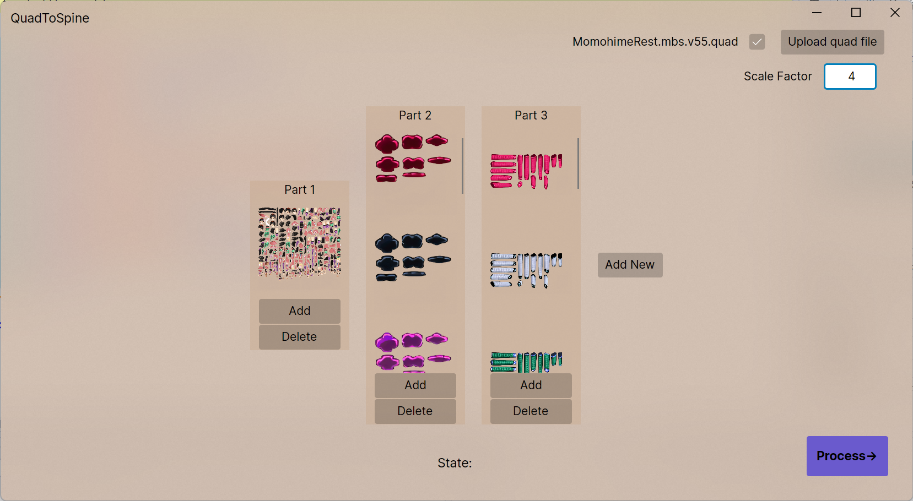
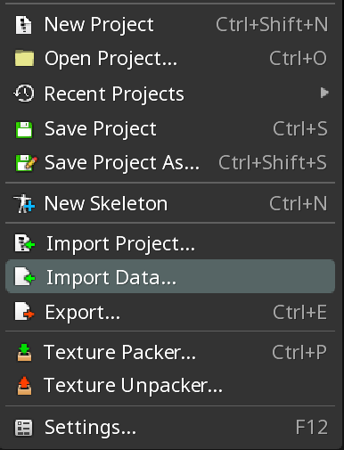
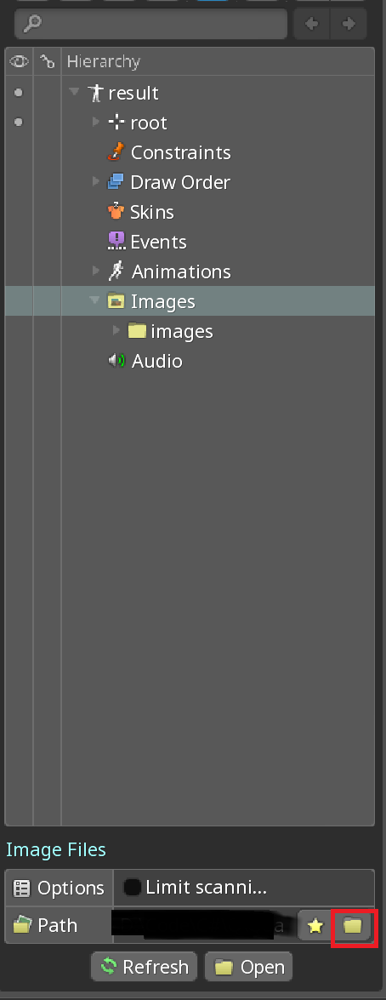
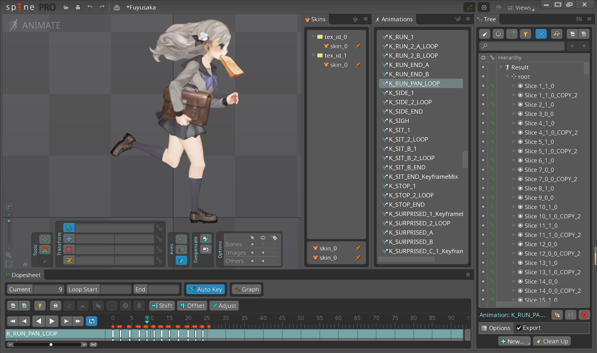
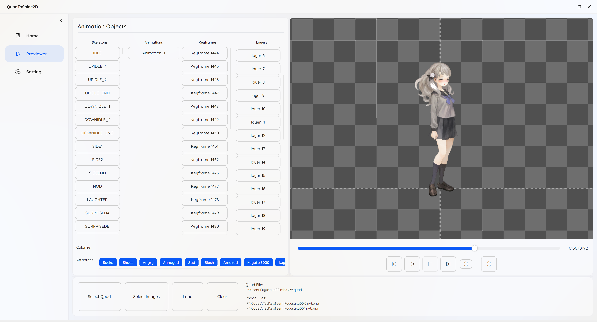
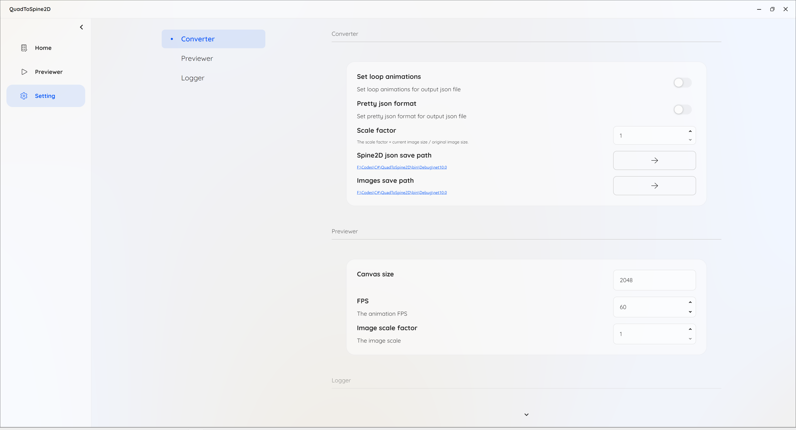

# QuadToSpine2D

QuadToSpine2D is a tool that converts 2D animation data from QUAD format to Spine 2D format, featuring real-time animation preview and seamless integration capabilities.

## 🎯 Supported Versions

+ Spine 2D 3.8

## 🚀 Getting Started

### Prerequisites

* [.NET 10 SDK](https://dotnet.microsoft.com/download/dotnet/10.0)
* Windows 10 or later
* Spine 2D 3.8 

#### Step 1: Convert QUAD to Spine Format
1. **Select QUAD File**: Click "Open Quad File" button to select your .quad file
2. **Add Image Resources**:
    - Click "+" button to add new image groups
    - Add corresponding image file paths for each group
    - Ensure correct image order
3. **Configure Scale Factor**: If your images are larger than original, scale factor = current image size / original image size
4. **Start Conversion**: Click "Process Data" button to begin conversion process
5. **Get Results**: After conversion, you will get **Result.json** file and **images** folder
   

#### Step 2: Import to Spine
1. **Open Spine**: Launch Spine 2D software
2. **Import JSON**: Import "Result.json" file (Ignore warnings)
   

3. **Import Images**: Import the generated images folder
   

4. **Check Animations**: Verify animations are displayed correctly (Make sure you have selected skin)
   

#### Alternative: Previewer Page
1. **Load Resources**:
    - Select QUAD file
    - Add image file paths
    - Click "Load" to load data
2. **Animation Control**:
    - Use play, pause, frame control functions
      

## ⚙️ Configuration Options

### Converter Settings
- **Scale Factor**: Adjust output image scaling ratio
- **Loop Animation**: Set whether to enable animation looping
- **JSON Formatting**: Choose output JSON formatting style
- **Save Path**: Customize result file and image save locations

### Previewer Settings
- **Canvas Size**: Adjust preview canvas dimensions
- **Frame Rate Control**: Set animation playback FPS
- **Image Scaling**: Control preview image display ratio

## 🛠 Setup Guides

* [How to get quad files](https://github.com/rufaswan/Web2D_Games/blob/master/docs/psxtools-steps.adoc)
* [Detailed Information](https://www.vg-resource.com/thread-38430.html)

## ⚠️ Known Issues

1. **Animation Order Problem**: Some animations are displayed in the wrong order
2. **Layer Display Missing**: Some animation layers are not displayed at all
3. **File Compatibility**: Cannot convert some quad files

## 💬 Support

For support, please open an issue on GitHub or contact the maintainers.

*For obtaining QUAD files, please refer to [psxtools documentation](https://github.com/rufaswan/Web2D_Games/blob/master/docs/psxtools-steps.adoc)*