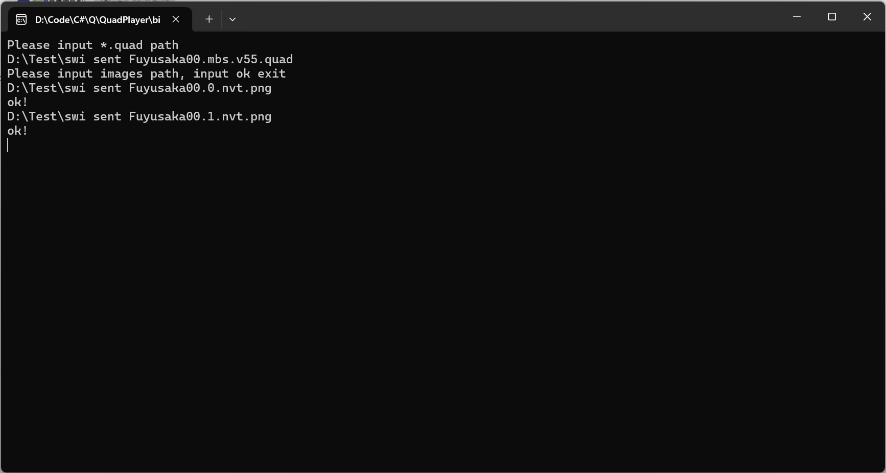

# **QuadToSpine**

## Support
+ Spine 3.8

## **How to use**

### **Runtime**
* [.NET8](https://dotnet.microsoft.com/zh-cn/download)

### **Setup**
* [how to get quad files](https://github.com/rufaswan/Web2D_Games/blob/master/docs/psxtools-steps.adoc)

## **First**
+ ### Input quad file path and images path.
  
+ ### You will get **result.json** and **images** folder.
# **Second**
1. ### Open Spine and import result. (Ignore warring)
+  
2. ### Import images
+ 
3. ### Check animations
+ 