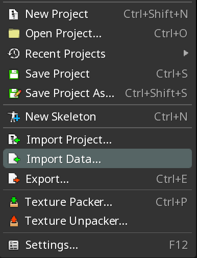
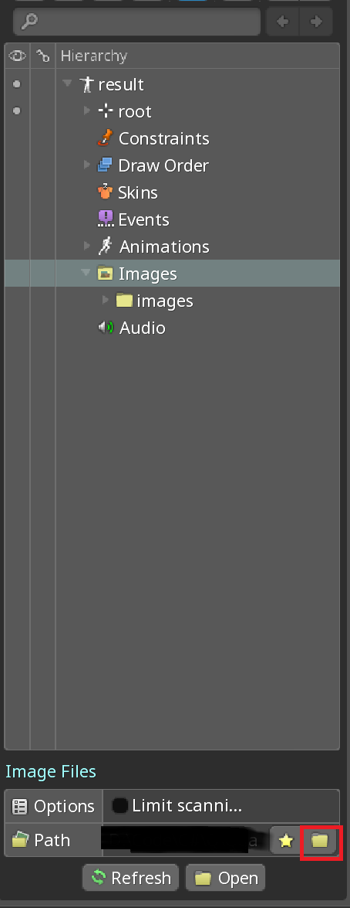
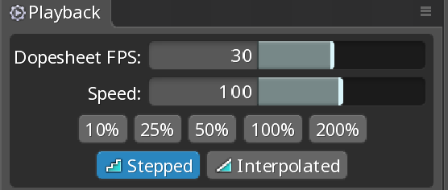
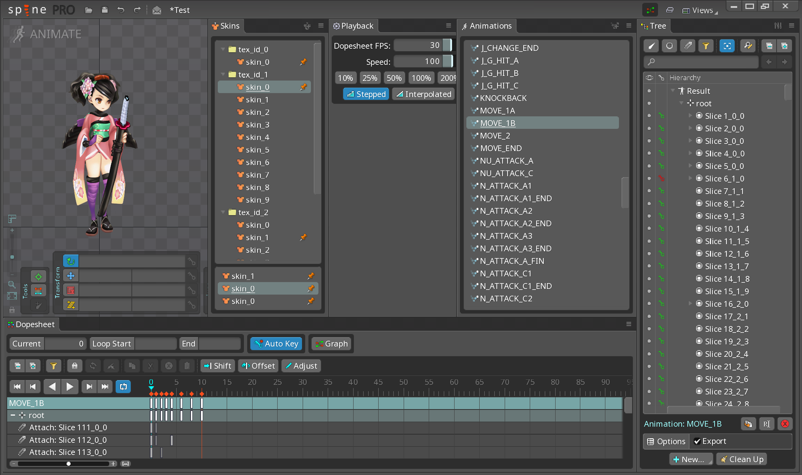

# **QuadToSpine**

## Support

+ Spine 3.8

## Known issues
1. **If the result.json file is too large, the import may fail.**
2. **Some animations are displayed in the wrong order.**
## **How to use**

### **Runtime**

* [.NET8](https://dotnet.microsoft.com/zh-cn/download)

### **Setup**

* [How to get quad files](https://github.com/rufaswan/Web2D_Games/blob/master/docs/psxtools-steps.adoc)

+ ### Input quad file path and images path.
  
+ ### You will get **result.json** and **images** folder.

+ ### Open Spine and import "result.json" . (Ignore warning)

+  

+ ### Import images

+ 

+ ### Set Playback
+ Open Views->Playback and set "Stepped"

+ 

+ ### Check animations

+ 
